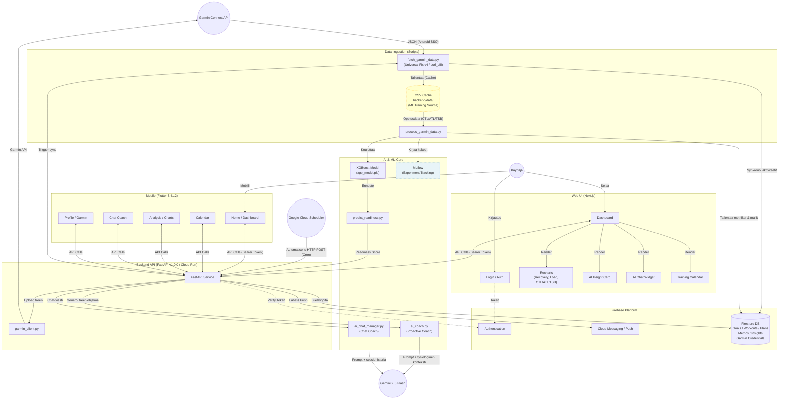

# Arkkitehtuuri – Personal AI Coach

## Järjestelmän Yleiskuva

Personal AI Coach on datalähtöinen valmennusjärjestelmä, joka yhdistää Garminin fysiologisen datan, koneoppimisen (XGBoost) ennustemallit ja generatiivisen tekoälyn (Gemini 2.5 Flash) tarjotakseen personoitua palautumisanalyysiä ja treenisuosituksia.

**Status (2026-04-18):** 🟢 Tuotantovalmis – Universal Fix v4 (Android SSO bypass) käytössä, 100 % Mobile-Web parity, Cloud Run (europe-north1) aktiivinen.

---

## Arkkitehtuurikaavio



---

## ML & AI Pipeline – Yksityiskohtainen kuvaus

### A) Koneoppimispipeline (XGBoost)

**Tavoite:** Ennustaa seuraavan aamun Body Battery (`bodyBatteryHighestValue`) nykyisten fysiologisten signaalien perusteella.

```
Garmin API
    ↓ fetch_garmin_data.py (Universal Fix v4)
CSV-välimuisti (backend/data/)
    ↓ process_garmin_data.py
Feature Engineering
    • CTL = 42 vrk EMA kuormituksesta
    • ATL = 7 vrk EMA kuormituksesta
    • TSB = CTL – ATL
    • poor_night_flag = 1 jos unilaatu < 45 pistettä
    • atl_growth = ATL muutos % viim. 7 vrk vs 30 vrk
    ↓
XGBoost GridSearchCV + TimeSeriesSplit (5-fold)
    ↓
xgb_model.pkl  +  model_metrics.json
    ↓ MLflow kirjaa: params, R², MAE, RMSE, feature_importance.png
    ↓ Firestore: model_performance/{uid}/history/{timestamp}
    ↓
/ai/model-metrics API-endpoint → UI:n "ML Health" -widget
```

**Tärkeimmät piirteet (feature importance):**

| Piirre | Selitys |
|--------|---------|
| `bodyBatteryHighestValue` (t-1) | Edellisen päivän huippu-BB → vahvin ennustaja |
| `bodyBatteryDuringSleep` | Unen aikainen latautuminen |
| `poor_night_flag` | Binäärinen: huono yö iskee suoraan seuraavan päivän valmiuteen |
| `averageStressLevel` | Päivän kokonaistressitaso |
| `TSB` | Harjoitusmuoto – positiivinen = levänneempi |
| `CTL` | Pitkän aikavälin kuntotaso |

**Mallin laatu:** R² ≈ 0.67–0.83 (riippuu datan pituudesta, min. 30 päivää). Selittää n. 70–83 % Body Batteryn vaihtelusta, mikä on korkea fysiologiselle datalle.

**Inkrementaalinen oppiminen:** Oletuksena `process_garmin_data.py` päivittää mallia vain uudella datalla (nopea). `--mode full` tekee koko GridSearchCV-ajon (hidas mutta tarkempi).

---

### B) Generatiivinen AI-pipeline (Gemini 2.5 Flash)

Sovelluksessa on **kaksi erillistä** Gemini-käyttötapausta:

#### B1) Proaktiivinen AI Coach (`ai_coach.py`)

```
Käyttäjä pyytää treeniohjelman / päivittäistä oivallusta
    ↓
ai_coach.construct_prompt()
    • Hakee tuoreimmat metriikat Firestoresta (BB, TSB, ATL, uni)
    • Laskee loukkaantumisriskin (ATL-kasvu % + unitrendi)
    • Hakee käyttäjän aktiiviset tavoitteet (kilpailu, viikko-km)
    • Rakentaa kontekstuaalisen promptin:
        – Tulkintaohjeet: BB 75–100 = kova treeni, 40–59 = kevyt, <40 = lepo
        – Varoitusohjeet: jos ATL kasvanut >20 % ja uni laskenut → vammariskivaroitus
    ↓
Gemini 2.5 Flash API
    ↓
Treeniohjelma JSON (3–7 päivää):
    • Jokaisessa päivässä: type, description, garmin_workout (askeleet: Warmup/Interval/Recovery)
    ↓
FastAPI tallentaa plans-kokoelmaan (Firestore)
    ↓
GarminClient.upload_workout() → Garmin Connect API (valinnainen)
```

**Päivittäinen välimuisti:** Oivallus lasketaan kerran päivässä per käyttäjä → tallennetaan Firestoreen `users/{uid}/daily_insights/{date}`. Quota-suoja: 429 palautetaan käyttäjälle selkeästi.

#### B2) Chat Coach (`ai_chat_manager.py`)

```
Käyttäjä lähettää viestin chatissa
    ↓
POST /ai/chat  (Bearer Token)
    ↓
ai_chat_manager.handle_chat()
    • Hakee käyttäjän tuoreet metriikat kontekstiksi
    • Ylläpitää session historiaa (max 10 viestiä)
    • System prompt: tiukat guardrailit (vain valmennus)
    ↓
Gemini 2.5 Flash API
    ↓
Vastaus käyttäjälle (Web: glassmorphism chat widget / Mobile: chat_screen.dart)
```

---

## Komponentit

### 0. Public Landing Page (Cloudflare Pages)
- **Landing Site (`landing_page/`):** Staattinen HTML/CSS markkinointisivu
- **Deployment:** Cloudflare Pages (globaali CDN, automaattinen SSL)
- **Live URL:** https://www.personalaicoach.ai
- Sisältää: GDPR (Privacy Policy, Terms of Service, Cookie Consent), Instructions-sivu

### 1. Web UI (Next.js + TypeScript)
- **`frontend/`:** React-pohjainen sovellus
  - **Dashboard:** Palautumismetriikat (BB, TSB, CTL/ATL), AI Insight Card, tavoitepalkit
  - **Training Calendar:** Interaktiivinen (Drag & Drop, Rescheduling, Garmin Export)
  - **Goal Management:** CRUD (weekly/monthly/target_date/race)
  - **AI Chat:** Glassmorphism-tyylinen float-widget
  - **Analysis:** Recharts-graafit (Recovery, Load, Performance)
  - **Admin Dashboard:** Käyttäjälista, palautteiden hallinta, Security Events
- **API Client:** `fetchWithRetry` + Firebase Bearer Token

### 2. Firebase Platform
- **Authentication:** Firebase Auth – JWT-tokenien validointi kaikissa pyynnöissä
- **Firestore – Rakenne:**
  ```
  users/{uid}/
    ├── workouts/{id}          # Harjoitukset (Garmin + manuaaliset)
    ├── plans/{id}             # AI-generoidut treenisuunnitelmat
    ├── goals/{id}             # Käyttäjän tavoitteet
    ├── garmin_credentials/    # AES-256 salatut tunnukset
    ├── daily_insights/{date}  # AI-oivallukset (välimuisti)
    └── garmin_mfa_required    # 2FA-tila
  garmin_metrics/{uid}/daily_metrics/{date}  # Fysiologinen päivädata
  model_performance/{uid}/history/{ts}       # ML-mallin metriikat
  feedback/                                  # Käyttäjäpalautteet
  security_events/                           # Rate limit- ja auth-tapahtumat
  ```

### 3. Backend API (FastAPI v1.0.0 – Cloud Run)
- **Sijainti:** `https://health-ai-backend-35976089058.europe-north1.run.app`
- **Autentikaatio:** `verify_token` (kaikki endpointit) + `verify_admin` (admin-endpointit)
- **Rate Limiting:** `slowapi` (IP-pohjainen, endpointtikohtaiset rajat)
- **Key endpointit:**

  | Endpoint | Kuvaus |
  |----------|--------|
  | `POST /system/refresh` | Laukaisee Garmin-synkronoinnin + ML-koulutuksen (async) |
  | `GET /system/refresh/status` | Pollataan synkronoinnin edistyminen (0–100 %) |
  | `POST /garmin/connect` | Yhdistää Garmin-tilin (Universal Fix v4) |
  | `POST /ai/insight` | Hakee/laskee päivittäisen AI-oivalluksen |
  | `POST /plans/generate` | Generoi treeniohjelman Geminin avulla |
  | `POST /ai/chat` | AI Chat Coach -viesti |
  | `GET /ai/model-metrics` | ML-mallin tarkkuus (R², MAE, feature importance) |
  | `GET /metrics/history` | Fysiologinen historia (CTL/ATL/TSB/BB/Sleep) |
  | `POST /workout/upload` | Vie treeni Garmin-kelloon |

### 4. Data Ingestion (Scripts)
- **`fetch_garmin_data.py`:**
  - Universal Fix v4: `curl_cffi`-istunto + `GCM_ANDROID_DARK` Android SSO
  - Batch-haku aktiviteeteille, rinnakkainen haku päiväkohtaisille metriikoille (`ThreadPoolExecutor`, max 5 säiettä)
  - Tallentaa CSV (välimuisti ML:lle) + synkronoi Firestoreen
- **`process_garmin_data.py`:**
  - Lukee CSV-historia → laskee CTL/ATL/TSB → feature engineering
  - Kouluttaa/päivittää XGBoost-mallin → tallentaa `xgb_model.pkl`
  - Kirjaa kokeen MLflow'hun → tallentaa metriikat Firestoreen

### 5. Configuration & DevOps
- **`backend/config.py`:** Pydantic Settings (`DevelopmentSettings` vs `ProductionSettings`)
- **CI/CD:** GitHub Actions
  - Backend → Docker → Google Cloud Run
  - Landing page → Cloudflare Pages (automaattisesti `main`-push)
  - Mobile → Firebase App Distribution (APK beta-jakelu)
  - Testit: `pytest` + `playwright` rinnakkain
- **Secrets:** Google Secret Manager (Cloud Runissa)

### 6. MLOps
- **MLflow:** `sqlite:///backend/data/mlflow.db` – jokainen koulutusjuoksu kirjataan
- **Tracking:** Hyperparametrit, CV-fold-metriikat, R², MAE, RMSE, feature importance PNG
- **UI:** `mlflow ui` → http://localhost:5000

### 7. Observability
- **Structured Logging:** `python-json-logger` – JSON-muotoiset lokit Google Cloud Loggingiin
- **Request Middleware:** Jokainen HTTP-pyyntö lokitetaan (method, path, status, kesto ms)
- **Security Events:** Rate limit -osumat + auth-epäonnistumiset → Firestore `security_events`
- **Google Cloud Error Reporting:** Tuotantovirheet (500) raportoidaan automaattisesti
- **Prometheus + Grafana:** `docker-compose.monitor.yml` – reaaliaikaiset metriikat kehityksessä

### 8. Mobiilisovellus (Flutter 3.41.2)
- **`mobile/`:** Natiivi Android & iOS
- **Näkymät:** Home (Dashboard) | Calendar | Analysis | Chat | Profile + Settings
- **Ominaisuudet:**
  - Kalenteri-skedulointi (treinin siirto BottomSheet-modaalilla + DatePicker)
  - Manuaalinen treenikirjaus (FAB → ManualWorkoutFormSheet)
  - AI Chat Coach
  - Garmin-hallinta (Connect / Reconnect / MFA-koodi)
  - Pull-to-Refresh kaikissa päänäkymissä
  - Sync Progress UI (0–100 % palkki Garmin-synkronoinnin aikana)
  - GDPR: datan vienti + tilin poisto
- **HTTP-timeout:** 60 s (kattaa Garmin-kirjautumiset + Gemini-vastaukset)
- **Sama Backend API** kuin web: Bearer Token auth

### 9. Garmin-integraatio & Cloudflare Bypass

> [!IMPORTANT]
> **PÄIVITYS (2026-04-12): "Universal Fix v4" Toteutettu**
> Data Ingestion Layer on päivitetty ohittamaan Garminin Cloudflare Bot Management -suojaukset matkimalla **virallista Garmin Android-sovellusta**.
>
> **Toteutus:**
> 1. **Identity Impersonation:** ClientId = `GCM_ANDROID_DARK` (Official Garmin Connect Mobile)
> 2. **SSO Bypass:** Suora JSON POST → `https://sso.garmin.com/portal/api/login` (ohittaa Cloudflare-haasteet)
> 3. **Custom OAuth1 Exchange:** Manuaalinen OAuth1-vaihto Android-kohtaiselle palvelulle (`mobile.integration.garmin.com/gcm/android`)
> 4. **TLS Fingerprinting:** `curl_cffi` matkii aitoa TLS-kättelyä
> 5. **Robust Serialization:** Token-tiedostot käsitellään `tempfile.TemporaryDirectory()`-kautta → yhteensopivuus `garth 0.2.x`/`0.3.x` välillä
>
> **Vaikutus:** 403/429-virheet poistettu. Garmin-synkronointi 100 % vakaa tuotannossa.
>
> 📄 Lisää: [garmin_cloudflare_bypass_v4.md](garmin_cloudflare_bypass_v4.md)

### 10. Tietoturva
- **Autentikaatio:** Firebase Bearer Token validointi kaikissa API-kutsuissa
- **Data Isolation:** Jokaisessa Firestore-kyselyssä `where('user_id', '==', uid)` -filtteri
- **Salaus:** AES-256 (Fernet) Garmin-salasanoille, avain Google Secret Managerissa
- **CORS:** Vain sallitut originit (`localhost:3000`, `app.personalaicoach.ai`)
- **Firestore Rules:** Row-level security – käyttäjät näkevät vain oman datansa
- **Rate Limiting:** `slowapi` IP-pohjaisesti, endpointtikohtaiset rajat
- **GDPR:** Data export (`GET /user/export`) + tilin poisto (`DELETE /account`)
