# 🔐 Autentikaatio & Monen käyttäjän toteutus

Tämä dokumentti kuvaa Health AI -sovelluksen käyttäjien tunnistautumisen toteutuksen Firebase Authenticationin avulla.

---

## 📋 Sisällysluettelo

1. [Arkkitehtuuri](#arkkitehtuuri)
2. [Kirjautumisvirta (Token Flow)](#kirjautumisvirta-token-flow)
3. [Frontend-toteutus](#frontend-toteutus)
4. [Backend-toteutus](#backend-toteutus)
5. [Käyttäjädatan eriyttäminen](#kayttajadatan-eriyttaminen)
6. [Testaus](#testaus)
7. [Vianmääritys](#vianmaaritys)

---

## Arkkitehtuuri

### Komponentit

```mermaid
sequenceDiagram
    participant User
    participant Frontend as Next.js<br/>(Frontend)
    participant FirebaseAuth as Firebase Auth
    participant Backend as FastAPI<br/>(Backend)
    participant Firestore as Firestore DB

    User->>Frontend: 1. Klikkaa "Sign in with Google" tai "Sign in with Apple"
    Frontend->>FirebaseAuth: 2. signInWithPopup(GoogleAuthProvider/OAuthProvider)
    FirebaseAuth-->>Frontend: 3. ID Token + User Object
    Frontend->>Frontend: 4. Tallenna user-state (AuthContext)
    
    User->>Frontend: 5. Pyydä dataa (esim. tavoitteet)
    Frontend->>Frontend: 6. user.getIdToken()
    Frontend->>Backend: 7. GET /goals<br/>Header: Bearer {token}
    Backend->>FirebaseAuth: 8. verify_id_token(token)
    FirebaseAuth-->>Backend: 9. Decoded Token (uid, email)
    Backend->>Firestore: 10. WHERE user_id == uid
    Firestore-->>Backend: 11. User's Goals
    Backend-->>Frontend: 12. JSON Response
    Frontend-->>User: 13. Näytä käyttöliittymässä
```



### Tietoturvaperiaatteet

1. **Zero Trust:** Jokainen API-kutsu validoidaan
2. **Token-Based Auth:** JWT-tokenin (Firebase ID Token) käyttö
3. **Row-Level Security:** Kaikki data filtteröidään `user_id`:llä
4. **Short-Lived Tokens:** Firebase ID Token vanhenee 1 tunnissa (automaattinen refresh)

---

## Kirjautumisvirta (Token Flow)

### 1. Kirjautuminen (Login)

**Frontend ([AuthContext.tsx](file:///c:/Users/samih/code/health_ai/frontend/src/context/AuthContext.tsx)):**

```typescript
// Google Sign-In
const signInWithGoogle = async () => {
    const provider = new GoogleAuthProvider();
    await signInWithPopup(auth, provider);
};

// Apple Sign-In
const signInWithApple = async () => {
    const provider = new OAuthProvider('apple.com');
    provider.addScope('email');
    provider.addScope('name');
    await signInWithPopup(auth, provider);
};
// Firebase SDK hoitaa automaattisesti:
// - Token-tallennus (IndexedDB)
// - onAuthStateChanged-tapahtuman
```

**Seuraavat askeleet:**
1. Firebase palauttaa `User`-objektin
2. `onAuthStateChanged` listener päivittää React state:n
3. Käyttäjä ohjataan `/dashboard` -sivulle

---

### 2. API-kutsu Tokenilla

**Token Haku:**

Jokaisessa API-kutsussa frontend hakee tuoreen tokenin:

```typescript
const token = await user.getIdToken();
// getIdToken() refreshaa automaattisesti vanhan tokenin tarvittaessa
```

**HTTP Header:**

```typescript
const response = await fetch(`${API_BASE_URL}/goals`, {
    headers: {
        'Authorization': `Bearer ${token}`
    }
});
```

> [!IMPORTANT]
> **Turvallisuus:** Token lähetetään AINA headerissa, ei URL-parametrissa tai bodyssä.

---

### 3. Backend Validointi

**Middleware ([auth_middleware.py](file:///c:/Users/samih/code/health_ai/backend/auth_middleware.py)):**

```python
from fastapi.security import HTTPBearer

security = HTTPBearer()

def verify_token(credentials: HTTPAuthorizationCredentials = Security(security)):
    token = credentials.credentials
    try:
        decoded_token = auth.verify_id_token(token)
        return decoded_token  # {"uid": "...", "email": "...", ...}
    except Exception:
        raise HTTPException(status_code=401, detail="Invalid token")
```

**Endpoint-käyttö:**

```python
@app.get("/goals")
def get_goals(user: dict = Depends(verify_token)):
    uid = user['uid']  # Validoitu käyttäjä-ID
    goals = db_manager.get_active_goals(uid)
    return goals
```

---

## Frontend-toteutus

### AuthContext (Global Authentication State)

**Tiedosto:** [`frontend/src/context/AuthContext.tsx`](file:///c:/Users/samih/code/health_ai/frontend/src/context/AuthContext.tsx)

**Vastuut:**
- Hallinnoi käyttäjän tila (`user: User | null`)
- Tarjoaa kirjautumis- ja uloskirjautumisfunktiot
- Kuuntelee Firebase auth-tilaa (`onAuthStateChanged`)

**Käyttö komponenteissa:**

```typescript
import { useAuth } from "@/context/AuthContext";

export default function MyComponent() {
    const { user, loading, signInWithGoogle, signInWithApple, signOut } = useAuth();
    
    if (loading) return <p>Loading...</p>;
    if (!user) return (
        <>
            <button onClick={signInWithGoogle}>Sign in with Google</button>
            <button onClick={signInWithApple}>Sign in with Apple</button>
        </>
    );
    
    return <p>Welcome, {user.displayName}!</p>;
}
```

---

### Protected Routes

**Pattern:** Jokainen suojattu sivu tarkistaa autentikaation:

```typescript
// frontend/src/app/dashboard/page.tsx
useEffect(() => {
    if (!loading && !user) {
        router.push("/login");
    }
}, [user, loading, router]);
```

---

### API Client Pattern

**Esimerkki:** Tavoitteiden hakeminen ([dashboard/page.tsx:48-51](file:///c:/Users/samih/code/health_ai/frontend/src/app/dashboard/page.tsx#L48-L51))

```typescript
const fetchGoals = async () => {
    const token = await user.getIdToken();
    const res = await fetch(`${API_BASE_URL}/goals`, {
        headers: { 'Authorization': `Bearer ${token}` }
    });
    const goals = await res.json();
    setGoals(goals);
};
```

> [!TIP]
> **Best Practice:** Älä tallenna tokenia state:en – hae aina `getIdToken()` juuri ennen API-kutsua välttääksesi vanhan tokenin käytön.

---

## Backend-toteutus

### Middleware Arkkitehtuuri

**Flow:**

1. FastAPI vastaanottaa HTTP-pyynnön
2. `HTTPBearer` poimii `Authorization: Bearer <token>` headerin
3. `verify_token()` validoi tokenin Firebase Admin SDK:lla
4. Jos validi → `decoded_token` injektoidaan endpointiin
5. Jos ei → `401 Unauthorized`

---

### Endpoint Pattern

**Template:**

```python
@app.get("/protected-endpoint")
@limiter.limit("10/minute")  # Rate limiting
async def my_endpoint(
    request: Request, 
    user: dict = Depends(verify_token)
):
    uid = user['uid']
    # Use uid to filter user-specific data
    data = db_manager.get_user_data(uid)
    return data
```

**Kaikki suojatut endpointit:**
- `/goals` (GET, POST, PUT, DELETE)
- `/workouts/*`
- `/plans/*`
- `/profile`
- `/ai/insight`
- `/user/export`

---

## Käyttäjädatan eriyttäminen

### Firestore Schema

**Rakenne:**

```
firestore/
├── goals/
│   ├── {goal_id}
│   │   ├── user_id: "abc123"         ← PAKOLLINEN
│   │   ├── activity_type: "Running"
│   │   └── ...
├── workouts/
│   ├── {workout_id}
│   │   ├── user_id: "abc123"         ← PAKOLLINEN
│   │   └── ...
├── users/
│   ├── {uid}/
│   │   ├── age: 35
│   │   └── daily_insights/           ← Subcollection
│   │       └── {date}/
│   │           └── insight: "..."
```

---

### Firestore Manager Pattern

**Tiedosto:** [`backend/firestore_manager.py`](file:///c:/Users/samih/code/health_ai/backend/firestore_manager.py)

**Automaattinen Filtteröinti:**

```python
def get_active_goals(user_id: str):
    docs = db.collection('goals')\
             .where(filter=FieldFilter('user_id', '==', user_id))\
             .where(filter=FieldFilter('status', '==', 'ACTIVE'))\
             .stream()
    # ... map results
```

> [!CAUTION]
> **Kriittinen Turvallisuussääntö:** Älä KOSKAAN palauta dataa ilman `user_id`-filtteröintiä!

**Esimerkki vaarallisesta koodista:**

```python
# ❌ VÄÄRIN - Palauttaa KAIKKIEN käyttäjien tavoitteet
def get_all_goals():
    return db.collection('goals').stream()

# ✅ OIKEIN - Palauttaa vain käyttäjän omat
def get_active_goals(user_id: str):
    return db.collection('goals')\
             .where('user_id', '==', user_id)\
             .stream()
```

---

### Owner Verification (DELETE/UPDATE)

**Pattern:** Varmista omistajuus ennen muokkausta:

```python
def delete_goal(user_id: str, goal_id: str):
    doc_ref = db.collection('goals').document(goal_id)
    doc = doc_ref.get()
    
    if not doc.exists:
        return False
    
    # ✅ Tarkista että pyytäjä on omistaja
    if doc.to_dict().get('user_id') != user_id:
        return False
    
    doc_ref.delete()
    return True
```

---

## Testaus

### Manuaalinen Testaus (Local Development)

**1. Tarkista Token:**

```bash
# Browser Dev Tools → Application → IndexedDB → firebaseLocalStorage
# Key: authUser - Contains user + token
```

**2. Testaa API Bearer Tokenilla:**

```bash
# 1. Hae token frontendista (Console):
# await firebase.auth().currentUser.getIdToken()

# 2. Testaa cURL:lla
curl -H "Authorization: Bearer YOUR_TOKEN_HERE" \
     http://localhost:8001/goals
```

**Odotettu tulos:**
```json
[{"id": "...", "activity_type": "Running", ...}]
```

---

### Virheellinen Token (Testaus)

```bash
curl -H "Authorization: Bearer invalid_token_123" \
     http://localhost:8001/goals
```

**Odotettu tulos:**
```json
{
  "detail": "Invalid authentication credentials"
}
```
HTTP Status: `401 Unauthorized`

---

### Unit Test Pattern

**Tulevaisuuden TODO (Phase 7.3):**

```python
# tests/test_auth.py
def test_endpoint_without_token():
    response = client.get("/goals")
    assert response.status_code == 401

def test_endpoint_with_valid_token(mock_firebase):
    mock_firebase.verify_id_token.return_value = {"uid": "test123"}
    response = client.get("/goals", headers={"Authorization": "Bearer valid"})
    assert response.status_code == 200
```

---

## Vianmääritys

### Yleiset Virheet

#### 1. `401 Unauthorized` (Frontend)

**Syyt:**
- Token vanhentunut (ei pitäisi tapahtua – `getIdToken()` refreshaa)
- Väärä header-format
- Firebase ei ole initalisoitu oikein

**Ratkaisu:**

```typescript
// ❌ Väärin
headers: { 'Authorization': token }

// ✅ Oikein
headers: { 'Authorization': `Bearer ${token}` }
```

---

#### 2. `auth/invalid-api-key` (Frontend Login)

**Syy:** Firebase config väärä (`.env.local`)

**Ratkaisu:**

```bash
# frontend/.env.local
NEXT_PUBLIC_FIREBASE_API_KEY=AIzaSyC...correct_key
NEXT_PUBLIC_FIREBASE_AUTH_DOMAIN=health-ai-....firebaseapp.com
# ... tarkista Firebase Console
```

---

#### 3. `auth/unauthorized-domain`

**Syy:** Domain ei ole whitelistattu Firebase Consolessa

**Ratkaisu:**

1. Firebase Console → Authentication → Settings → Authorized Domains
2. Lisää:
   - `localhost` (kehitys)
   - `192.168.1.XXX` (mobiilikehitys)
   - Tuotanto-domain (production)

---

#### 4. CORS Error (Backend)

**Syy:** Frontend domain ei ole sallittu backendissä

**Ratkaisu:**

```python
# backend/main.py
app.add_middleware(
    CORSMiddleware,
    allow_origins=["http://localhost:3000", "http://192.168.1.130:3000"],
    allow_credentials=True,
    allow_methods=["*"],
    allow_headers=["*"],
)
```

---

#### 5. Backend: `Invalid token` (vaikka frontend toimii)

**Debugging:**

```python
# backend/auth_middleware.py - Lisää loggaus
try:
    decoded_token = auth.verify_id_token(token)
    print(f"✅ Valid token for: {decoded_token.get('email')}")
    return decoded_token
except Exception as e:
    print(f"❌ Token error: {type(e).__name__} - {str(e)}")
    raise HTTPException(...)
```

**Yleiset syyt:**
- Backend käyttää väärää `service_account_key.json`
- Firebase Admin SDK ei ole initalisoitu
- Token on eri Firebase-projektista

---

### Debug Checklist

Käy läpi tämä lista ongelmatilanteessa:

- [ ] Frontend: `user` objekti ei ole `null`
- [ ] Frontend: `user.getIdToken()` palauttaa stringin
- [ ] Network Tab: `Authorization: Bearer abc...` header lähtee
- [ ] Backend: `service_account_key.json` on oikea tiedosto
- [ ] Backend: Port `8001` vastaa (Docker Up)
- [ ] Firebase Console: Käyttäjä näkyy Authentication → Users

---

## Tietoturvan parhaat käytännöt

### ✅ DO (Tee näin)

1. **Käytä HTTPS tuotannossa** (pakollinen Firebase Authille)
2. **Älä koskaan commitoi `.env` tai `service_account_key.json`** → `.gitignore`
3. **Käytä Rate Limiting** → `@limiter.limit("10/minute")` (slowapi)
4. **Validoi AINA user_id backendissä** → Älä luota frontend-dataan
5. **Käytä Bearer Token formatia** → `Authorization: Bearer {token}`

### ❌ DON'T (Vältä näitä)

1. ❌ Älä tallenna tokenia localStorage:en (Firebase SDK hoitaa turvallisesti)
2. ❌ Älä lähetä tokenia URL-parametrissa (`/api?token=abc`)
3. ❌ Älä jätä test-käyttäjiä tuotantoon (Firebase Console → Users)
4. ❌ Älä salli `allow_origins=["*"]` tuotannossa (tarkenna domainit)
5. ❌ Älä ohita `verify_token` middleware missään endpointissa

---

## Seuraavat askeleet (Monen käyttäjän skaalautuvuus)

### Nykyinen Tilanne (MVP)

- ✅ Firebase Auth integroitu (Google + Apple)
- ✅ Token-validointi toimii
- ✅ Multi-user data isolation (Firestore)
- ⏳ **Apple Sign-In:** Koodi valmis, Firebase Console konfiguraatio odottaa
- ⚠️ **Garmin-data:** Yhteinen CSV kaikille (ei skaalaudu)

### Tulevaisuus (Production Scaling)

1. **User Roles & Admin Panel:**
   - Lisää `role` kenttä Firestoreen (`admin`, `user`)
   - Admin-endpointit ainoastaan `role == admin` käyttäjille

2. **OAuth2 Garmin Integration:**
   - Jokainen käyttäjä kirjautuu omaan Garmin-tiiliinsä
   - Token tallennetaan: `users/{uid}/garmin_credentials`

3. **Email/Password Login (Optional):**
   - Google/Apple-kirjautumisen lisäksi: `signInWithEmailAndPassword`

4. **Session Management:**
   - Näytä aktiiviset sessiot käyttäjälle
   - "Sign out all devices" -toiminto

---

## Yhteenveto

### Teknologiat

| Kerros | Teknologia | Rooli |
|--------|-----------|-------|
| Frontend | Firebase JS SDK | Token management, Login UI |
| Transport | HTTP Bearer Token | API Authentication |
| Backend | Firebase Admin SDK | Token verification |
| Database | Firestore | Row-level security (`user_id`) |

### Token Lifecycle

1. **Login:** Firebase Auth → ID Token (1h TTL)
2. **API Call:** Frontend → `getIdToken()` → Auto-refresh
3. **Backend:** Verify → Extract `uid` → Filter data
4. **Logout:** Firebase SDK → Clear tokens

---

> [!NOTE]
> Tämä dokumentti päivitetään kun uusia autentikointimekanismeja (email/password, admin roles) lisätään.

**Viimeksi päivitetty:** 2026-02-03  
**Dokumentaation kattavuus:** Firebase Google Auth + Apple Sign-In (koodi valmis)  
**TODO:** Apple Firebase Console setup, Garmin OAuth2, Admin Roles
