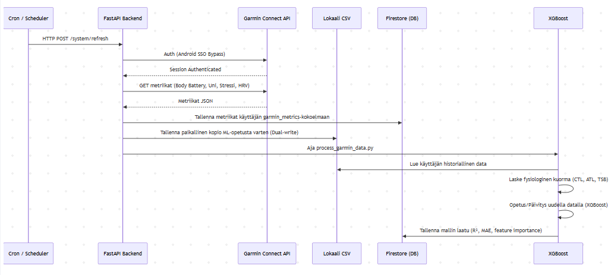
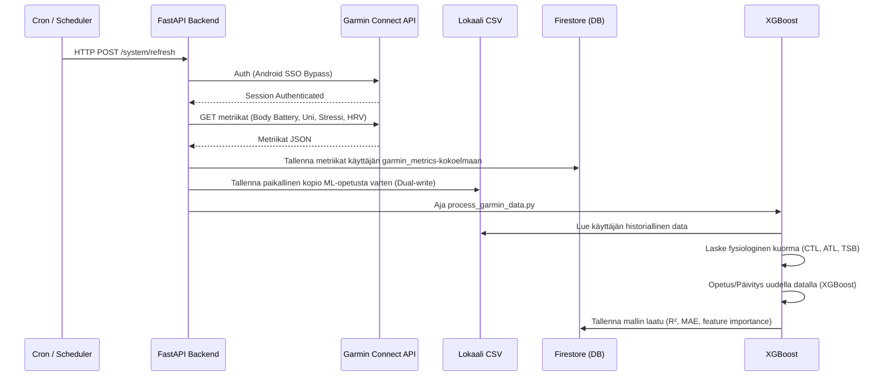
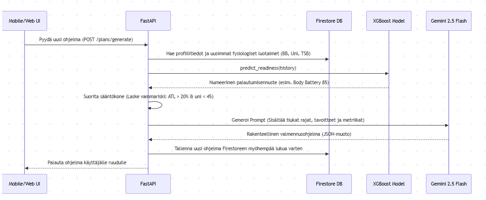
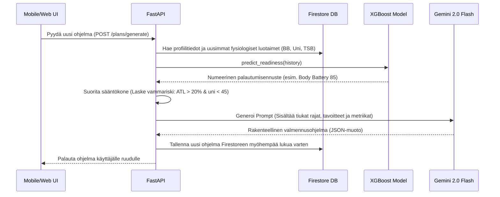
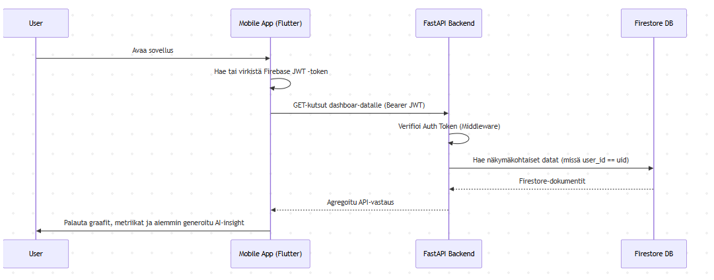
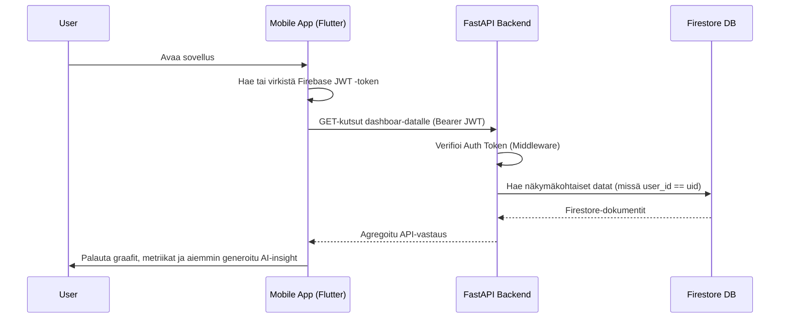

# Personal AI Coach: Datan Kulku (Data Flow)

Tämä dokumentti kuvaa tarkemmin, miten data liikkuu Health AI -järjestelmässä aina Garminin palvelimilta koneoppimismallin ja Gemini-tekoälyn kautta käyttäjän mobiili- ja web-käyttöliittymiin.

## 1. Ydindatakomponentit (Data Entities)

Järjestelmä käsittelee seuraavia päädatakokonaisuuksia:
- **Tunnistetiedot (Credentials):** Salattu AES-256 -muodossa, käytetään ainoastaan taustajärjestelmässä yhteyden ylläpitoon (Garmin SSO).
- **Fysiologinen data (Metrics):** Body Battery, leposyke, uni (kesto ja laatu), HRV, stressi. Nämä ohjaavat tekoälyn valmennuspäätöksiä.
- **Harjoitusdata (Workouts):** Suoritetut treenit ja suunnitellut treenit (AI:n tekemät ohjelmat).
- **Tavoitteet (Goals):** Käyttäjän asettamat määrälliset rajapyykit (esim. matkatavoite viikossa) tai kisatavoitteet.
- **AI-tuotokset (Insights/Plans):** Päivittäiset aamubriefingit ja treeniohjelmat, joita tallennetaan tietokantaan välimuistiin API-kutsujen minimoimiseksi.

---

## 2. Pääprosessien Sekvenssikaaviot (Sequence Diagrams)

### 2.1 Taustasynkronointi ja Datan Rikastus (Background Sync & Ingestion)

Tämä prosessi ajetaan joko säännöllisesti taustalla (Cloud Scheduler) tai käyttäjän manuaalisesta pyynnöstä (`POST /system/refresh`). Tavoitteena on hakea tuorein fysiologinen data, tallentaa se pysyvästi ja opettaa ML-mallia.

### 2.2 Proaktiivisen Tekoälyvalmentajan Kierto (AI Coach Generation)

Tämä kuvaa, miten Gemini 2.0 Flash muodostaa valmennus- tai viikko-ohjelman hyödyntäen aiemmin tietokantaan tallennettua luotettavaa dataa.

### 2.3 Käyttöliittymän Datan Kulutus (UI Data Fetch)

Web- ja mobiilialustat eivät ikinä keskustele reaaliajassa ulkoisten rajapintojen (kuten Garminin) kanssa sovellusta avattaessa, jotta sovellus on nopea ja saavutettavissa offline/rate limit -tilanteissa.

---

## 3. Välimuisti (Caching) ja Datan Pysyvyys (Persistence)

Järjestelmä on suunniteltu huomioiden skaalautuvuus ja ulkoisten rajapintojen asettamat rajoitukset (esim. Garminin 429 Rate Limits / Gemini Quotas).

1. **Asynkroninen Garmin Ingestion:** Järjestelmä hakee dataa ensisijaisesti taustalla tai erillisestä latauspyynnöstä. Data tallennetaan **Firestoreen**. Tämän jälkeen kaikki analytiikka ja UI-toiminnallisuus operoi pelkällä Firestore-datalla.
2. **Koneoppimisen Opetusdata (CSV vs DB):** Kustannustehokkuuden vuoksi massiivinen koneoppimisdata cachataan taustajärjestelmässä (FastAPI) nopeaan paikalliseen CSV/tiedostokerrokseen.
3. **AI-tulosten välimuistitus:** Oivallukset (Insight) lasketaan tyypillisesti vain kerran päivässä. FastAPI tutkii ensin Firestoren. Jos tälle päivälle tehty analyysi on jo olemassa, se palautetaan salamannopeasti säästäen kallista LLM-kutsua.

## 4. Virhetilanteiden Ratkaisu Datavirrassa (Edge Cases)

* **Garmin Rate Limit (429):** Jos Garmin pyytää hidastamaan (Too Many Requests), FastAPI aktivoi heti in-memory lukon (Lock) esimerkiksi 15 minuutiksi. Sovellus toimii käyttäjälle normaalisti, ja se esittää Firestoressa olevaa vanhempaa historiaa, kehottaen yrittämään synkronointia hetken kuluttua uudelleen.
* **MFA (Monivaiheinen todennus) katkaisee yhteyden:** Kun Garmin vaatii vahvennettua todennusta, taustasynkronointi pysähtyy ja taustajärjestelmä tallentaa lipputiedon `garmin_mfa_required = True`. Etusivun käyttöliittymä reagoi tähän viittaukseen heti lukemalla datan, avaten käyttäjälle koodikyselynäkymän, jolla datavirta palautetaan jälleen toimintaan.
