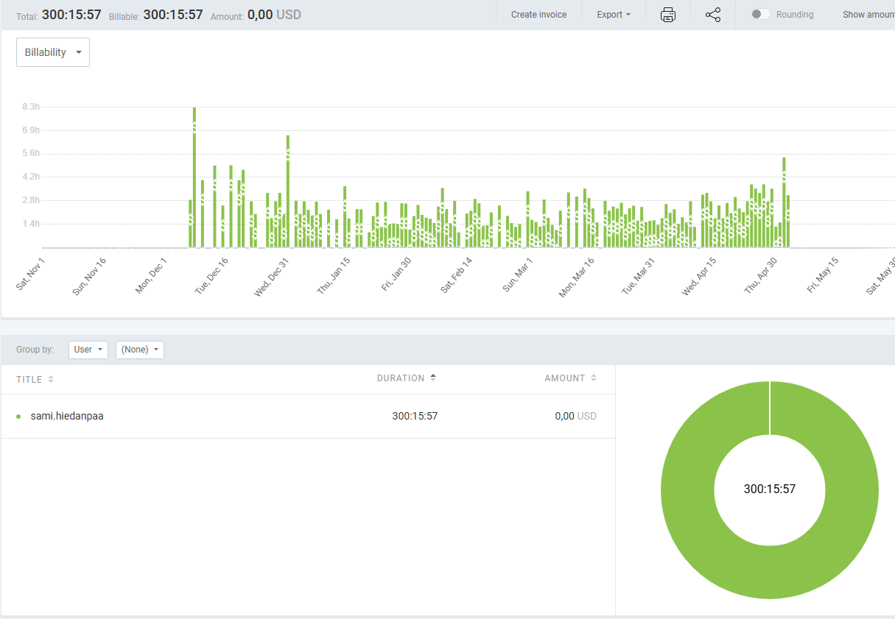

# Itsearviointi ja ajankäyttö

## Ajankäyttö

Projekti kehitettiin aktiivisesti joulukuusta 2025 alkaen ja tuotiin tuotantovalmiiksi toukokuussa 2026. 

- **Aktiivisia kehityspäiviä:** 110 päivää (6kk), työtunteja 300h.

- **Koodin määrä:** Yhteensä noin 65 000 lisättyä koodiriviä ja konfiguraatiota.
- **Työn jakautuminen:** Kehitystyö jakautui kolmen suuren kokonaisuuden kesken:
  1. **Backend & AI:** Python-backend (FastAPI), koneoppimismallin opetus (XGBoost) ja Gemini-tekoälyintegraatiot.
  2. **Web-alustat:** Next.js -pohjainen käyttöliittymä ja Cloudflare Pages -markkinointisivu.
  3. **Mobiili:** Ristiinalustainen Flutter-mobiilisovellus.

## Itsearviointi

### 1. Mitkä tunnelmat jäivät projektista kokonaisuutena?
Projektista jäi kokonaisuutena hyvä, mutta jälkikäteen myös huojentunutolo. Työ laajeni matkan varrella yksinkertaisesta ideasta täysimittaiseksi, monialustaiseksi tuotteeksi (Backend, Web, Mobile). Teknisten haasteiden – erityisesti Garminin bottiestojen ohittamisen ja tekoälyn integroinnin – selättäminen antoi todella vahvan onnistumisen tunteen. Projekti vaati paljon pitkäjänteisyyttä, mutta lopputuloksena syntynyt tuotantovalmis järjestelmä osoittaa, että kova työ palkittiin.

### 2. Mitä opin?
Keskeisimpiä oppeja olivat:
- **Järjestelmäarkkitehtuuri ja skaalautuvuus:** Opin viemään monoliittisen backendin modulaariseen rakenteeseen (FastAPI APIRouter) ja suunnittelemaan selkeitä datavirtoja.
- **Kolmannen osapuolen API-haasteet:** Syvensin osaamistani verkkoliikenteen analysoinnissa ja edistyneissä kyselytekniikoissa (esim. Cloudflaren bot-suojauksen ohittaminen `curl_cffi`:llä).
- **Kokonaisvaltainen Full-Stack & Mobile:** Reactin/Next.js:n, Flutterin ja Python-backendin saumaton yhteensovittaminen samaan ekosysteemiin.
- **Tekoälyn soveltaminen tuotannossa:** Miten yhdistää perinteinen koneoppiminen (XGBoost) ja generatiivinen tekoäly (Gemini) tuottamaan loppukäyttäjälle aitoa lisäarvoa.
- **DevOps & Turvallisuus:** CI/CD-käytännöt, dokumentoinnin tärkeys (MkDocs) sekä tietoturva-auditointien ja salaisuuksien hallinnan (Firebase-avaimet) merkitys.

### 3. Missä haluaisin vielä parantaa toimintaani?
- **Testausautomaatio:** Vaikka sovellus on vakaa, olisin voinut panostaa kattavampiin yksikkö- ja E2E-testeihin (End-to-End) jo varhaisemmassa vaiheessa, jolloin refaktorointi olisi ollut vieläkin turvallisempaa.
- **Ajanhallinta haastavien ongelmien parissa:** Joskus jäin jumiin epävirallisten rajapintojen (kuten Garminin rate-limitit) tuottamiin "jäniksenkoloihin". Jatkossa voisin pyrkiä tunnistamaan umpikujat nopeammin ja siirtymään vaihtoehtoisiin ratkaisuihin aikaisemmin. Valitettavasti en Garmin Dev-oikeuksia vielä tähän päivään mennessä ole saanut, pyynnöstä huolimatta.

### 4. Mitä tekisin toisin?
- **Arkkitehtuuri edellä:** Aloittaisin backendin kehityksen suoraan modulaarisella rakenteella (esim. routerit ja dependency injection) sen sijaan, että joutuisin refaktoroimaan monoliittia myöhemmin.
- **Vikasietoisuus API-integraatioissa:** Rakentaisin ulkoisiin rajapintoihin (kuten Garmin) vahvemmat retry- ja fallback-mekanismit heti alusta alkaen, olettaen että ne tulevat rikkoutumaan tai rajoittamaan liikennettä.
- **Tietoturvan "Shift-Left":** Kiinnittäisin heti alussa vielä tarkempaa huomiota ympäristömuuttujien ja salaisuuksien hallintaan, jotta vahinkoja (esim. avainten päätyminen Git-historiaan) ei pääsisi käymään ja auditoinneilta vältyttäisiin.

### 5. Minkä arvosanan antaisin itselleni asteikolla 1-5?
**Arvosana: 4**

*Perustelu:* Projekti osoitti laajuudessaan, monipuolisuudessaan ja teknisessä toteutuksessa kykyä tuottaa korkealaatuista ohjelmistokehitystyötä. Siinä katettiin moderni stack (Next.js, Flutter, FastAPI, Cloudflare, PostgreSQL, ML/AI). Erityisen vahvana osaamisalueena nousi esiin kyky ratkaista teknisesti erittäin haastavia ja epästandardeja ongelmia, kuten Garminin epävirallisten API:en luotettava hyödyntäminen ja sen vaatima syvällinen verkkoliikenteen analyysi. Myös kokonaisuuden hallinta (DevOps, dokumentaatio) oli hyvällä tasolla. Arvosanaa laskee lievästi se, että alkuvaiheen suunnittelussa ja testiautomaatiossa olisi voinut tehdä tehokkaampia valintoja, mikä olisi helpottanut myöhempää kehitystyötä. Kokonaisuutena suoritus on kuitenkin erinomainen.
