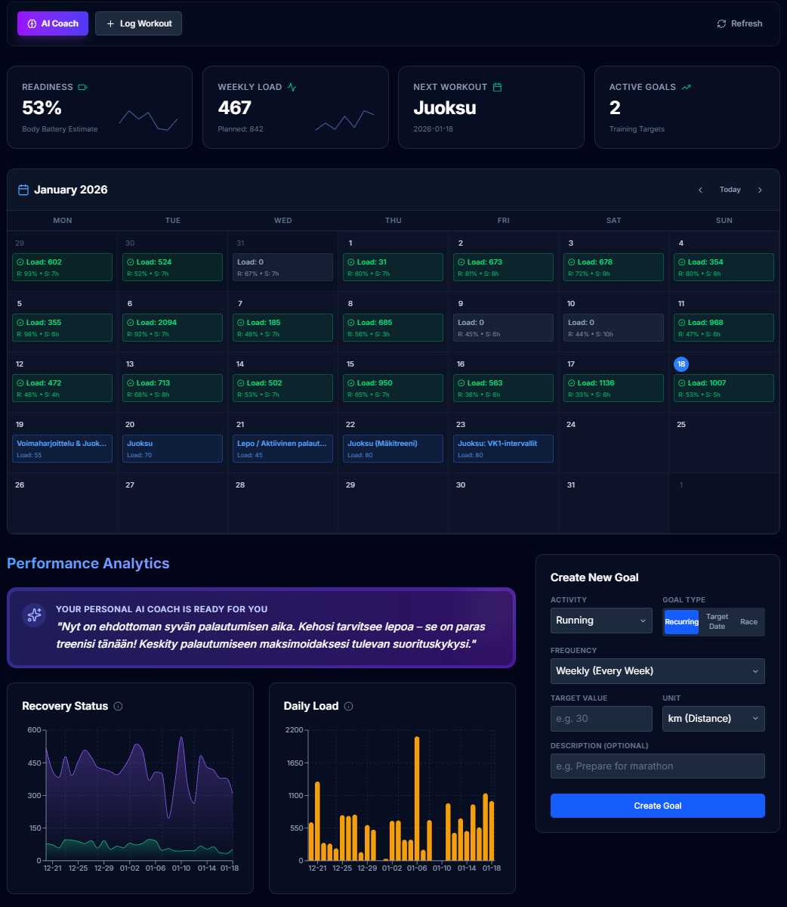
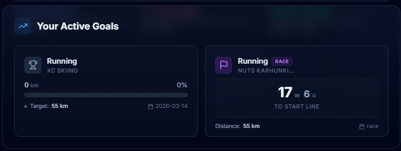
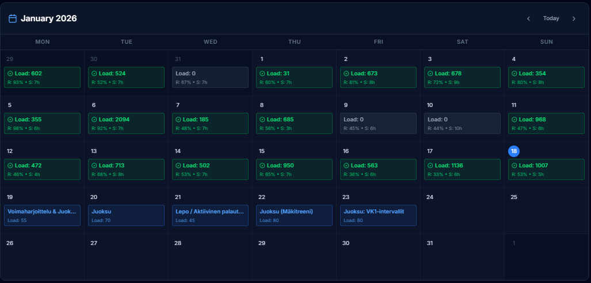
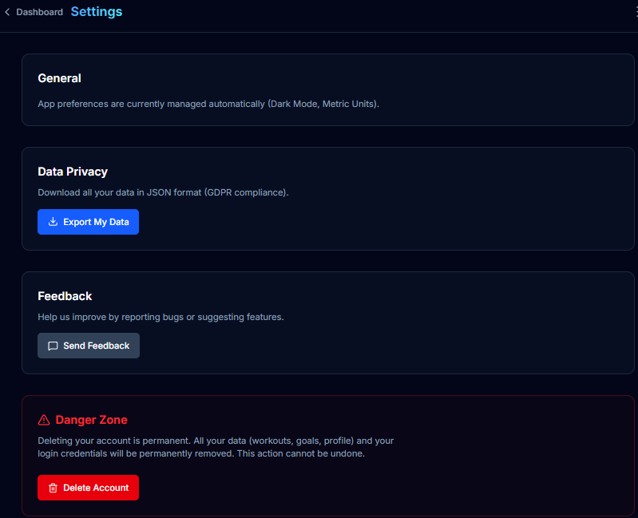
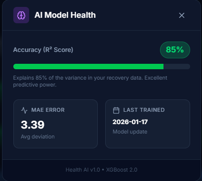

# Personal AI Coach

**Personal AI Coach** on älykäs, dataohjautuva valmennusjärjestelmä, joka auttaa optimoimaan palautumista ja harjoittelua.

Se yhdistää:
1.  **Garmin-datan** (uni, stressi, sykevariabiliteetti).
2.  **Machine Learning -mallin (XGBoost)**, joka ennustaa päivän vireystilan (Training Readiness / Body Battery).
3.  **Generatiivisen tekoälyn (Google Gemini)**, joka toimii henkilökohtaisena valmentajana ja luo päivittäiset treenisuositukset datan perusteella.

## Ominaisuudet
*   **Älykäs Dashboard:** Reaaliaikainen näkymä palautumisen tilasta ja treenihistoriasta.
*   **Treenikalenteri:** Visuaalinen yleisnäkymä (Kuukausi/Viikko), jossa erottuvat tehdyt ja suunnitellut treenit.
*   **Adaptiivinen AI Coach:** Valmentaja, joka huomioi väsymyksen ja luo uuden ohjelman yhdellä klikkauksella.
*   **Tavoitteellisuus:** Täysi hallinta tavoitteille (Lisää/Muokkaa/Poista) eri lajeissa (Juoksu, Hiihto, Pyöräily, etc.).
*   **Data & Analytiikka:** Kirjaa manuaaliset treenit ja seuraa "Suunniteltu vs Toteutunut" -kuormitusta viikkotasolla.
*   **Home View:** Keskitetty etusivu, joka näyttää heti palautumisen tilan ja seuraavan treenin.
*   **Tarkka Ennustemalli:** Omatuntoon perustuvaa arviota tarkempi koneoppimismalli vireystilan arviointiin.
*   **CI/CD Laatu:** Automaattiset yksikkötestit ja koodin laaduntarkistus (GitHub Actions).

## Teknologiat
*   **Frontend:** Next.js (React), TypeScript, Tailwind CSS
*   **Backend / AI:** Python, FastAPI, XGBoost, Google Gemini API
*   **Tietokanta:** DuckDB (Data Science), Firebase Firestore (App Data & Auth)
*   **Infra:** Docker

## Käynnistys (Local Development)

### 1. Backend (API)
```bash
# Vaihtoehto A: Docker (Suositus)
docker-compose up backend

# Vaihtoehto B: Manuaalisesti
cd backend
# Varmista virtuaaliympäristö
../.venv/Scripts/activate
uvicorn main:app --reload
```
API vastaa osoitteessa: `http://localhost:8000`

### 2. Frontend (Web App)
```bash
cd frontend
npm install # Ensimmäisellä kerralla
npm run dev
```
Sovellus on käytettävissä: `http://localhost:3000`

## Arkkitehtuuri
*   **Frontend:** Next.js - Moderni ja responsiivinen käyttöliittymä.
*   **Backend:** FastAPI - Tehokas rajapinta datan käsittelyyn ja AI-logiikkaan.
*   **Data Pipeline:** 
    *   `backend/scripts/`: Scriptit datan hakuun (Garmin) ja mallien koulutukseen.
    *   `backend/data/`: Paikalliset tietovarastot (`health_ai.db`).
*   **Firebase:**
    *   **Authentication:** Käyttäjien hallinta ja kirjautuminen.
    *   **Firestore:** Reaaliaikainen tietokanta käyttäjädatalle (tavoitteet, treenit).

## 📸 Screenshots

> **Note:** Screenshots coming soon! To see the app in action, run it locally (see [Käynnistys](#käynnistys-local-development)).

**Dashboard:**
- Recovery metrics and AI insights
- Goal tracking with progress bars
- Weekly training calendar



**Goal Management:**
- Create recurring or race goals
- Track progress with visual indicators
- Edit and delete functionality



**Training Calendar:**
- Month and week views
- Drag-and-drop workout planning
- Completed vs. planned workout visualization



**Profile & Settings:**
- Secure Garmin integration (AES-256 encrypted)
- User profile management
- GDPR-compliant data export



**Model Accuracy:**
- XGBoost model performance metrics
- Training and validation accuracy
- Feature importance visualization




---

## 🔌 API Documentation

**Interactive API Docs (Swagger UI):**
```
http://localhost:8001/docs
```

**Full API Reference:** [Docs/API.md](Docs/API.md)

**Quick Example:**
```bash
# Get your goals
curl -H "Authorization: Bearer YOUR_FIREBASE_TOKEN" \
     http://localhost:8001/goals
```

---

## 🔧 Troubleshooting

### Port Already in Use

**Problem:** `Error: Address already in use` when starting backend/frontend

**Solutions:**

**Backend (Port 8001):**
```bash
# Find process using port
lsof -i :8001  # Mac/Linux
netstat -ano | findstr :8001  # Windows

# Kill process
kill -9 <PID>  # Mac/Linux
taskkill /PID <PID> /F  # Windows

# Or use different port
uvicorn main:app --port 8002
```

**Frontend (Port 3000):**
```bash
# Use different port
PORT=3001 npm run dev
```

---

### Firebase Credentials Missing

**Problem:** `GOOGLE_APPLICATION_CREDENTIALS not found`

**Solution:**
1. Download service account key from [Firebase Console](https://console.firebase.google.com) → Project Settings → Service Accounts
2. Save as `backend/service_account_key.json`
3. Set environment variable:
   ```bash
   export GOOGLE_APPLICATION_CREDENTIALS="$(pwd)/backend/service_account_key.json"
   ```
4. Or update `.env` file

**Problem:** `No Firebase config` in frontend

**Solution:**
1. Create `frontend/.env.local`:
   ```bash
   NEXT_PUBLIC_FIREBASE_API_KEY=your-key
   NEXT_PUBLIC_FIREBASE_AUTH_DOMAIN=your-domain
   NEXT_PUBLIC_FIREBASE_PROJECT_ID=your-project-id
   ```
2. Restart dev server

---

### CORS Errors

**Problem:** `CORS policy: No 'Access-Control-Allow-Origin' header`

**Solution:**
1. Verify backend is running on correct port
2. Check frontend `API_BASE_URL` in `frontend/src/lib/utils.ts`
3. Ensure backend CORS middleware allows your origin:
   ```python
   # backend/main.py
   allow_origins=["http://localhost:3000"]
   ```

---

### Docker Issues

**Problem:** `Error response from daemon: Conflict`

**Solution:**
```bash
# Stop all containers
docker-compose down

# Remove old containers
docker-compose rm -f

# Rebuild
docker-compose up --build backend
```

**Problem:** Docker can't find `service_account_key.json`

**Solution:**
1. Verify file exists: `ls backend/service_account_key.json`
2. Check `docker-compose.yml` volume mounts
3. Rebuild: `docker-compose up --build`

---

### Environment Variables

**Problem:** `ENCRYPTION_KEY not set`

**Solution:**
```bash
# Generate new key
cd backend
python encryption_helper.py  # Shows generated key

# Add to .env
echo "ENCRYPTION_KEY=your-generated-key" >> .env
```

---

### Database Issues

**Problem:** `No data showing in dashboard`

**Solution:**
1. Check if Garmin data fetched:
   ```bash
   ls Health_AI/data/garmin_*.csv
   ```
2. Manually trigger refresh:
   - Dashboard → Click "Refresh" button
   - Or: `POST http://localhost:8001/system/refresh`
3. Check Firestore Console for data

---

### Common Errors

| Error | Cause | Fix |
|-------|-------|-----|
| `401 Unauthorized` | Invalid/expired Firebase token | Re-login in frontend |
| `429 Too Many Requests` | Rate limit exceeded | Wait 1 minute, try again |
| `Module not found` | Missing dependencies | `npm install` / `pip install -r requirements.txt` |
| `Connection refused` | Backend not running | Start backend: `docker-compose up backend` |

---

### Need More Help?

1. Check logs:
   ```bash
   # Backend logs
   docker-compose logs backend
   
   # Frontend logs
   # Check terminal where 'npm run dev' is running
   ```

2. Enable debug mode:
   ```bash
   # Backend
   export DEBUG=true
   
   # Frontend
   # Add to .env.local:
   NEXT_PUBLIC_DEBUG=true
   ```

3. Review documentation in `Docs/` folder

## 📚 Dokumentaatio

Lisää teknisiä yksityiskohtia ja arkkitehtuurikuvauksia löydät `Docs/`-kansiosta:

- **[API.md](Docs/API.md)** - Complete API reference, endpoints, examples
- **[authentication.md](Docs/authentication.md)** - Firebase Authentication toteutus, token flow, multi-user data isolation
- **[arkkitehtuuri.md](Docs/arkkitehtuuri.md)** - Järjestelmän arkkitehtuuri, komponentit ja datavirrat
- **[production_roadmap.md](Docs/production_roadmap.md)** - Kehityspolku 0 → 10,000 käyttäjää, skaalautuvuussuunnitelma
- **[sami_memo.md](Docs/sami_memo.md)** - Kehityspäiväkirja ja muutoshistoria
- **[garmin_setup.md](Docs/garmin_setup.md)** - Garmin credentials setup and troubleshooting

