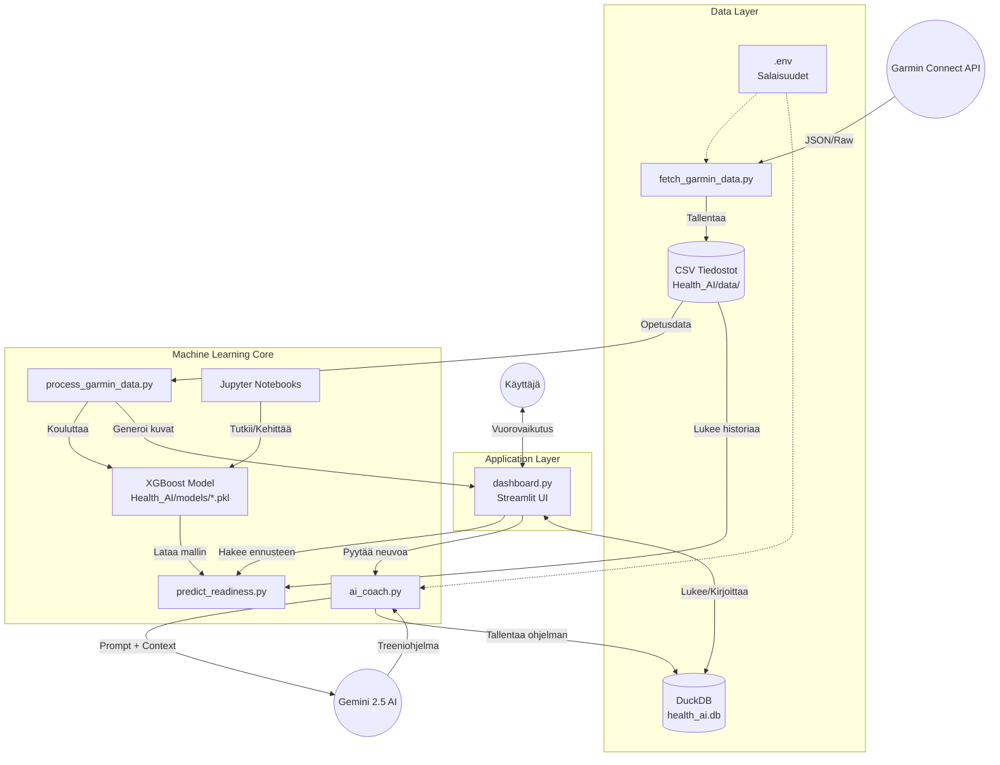

# Arkkitehtuuri - Sami's AI Coach

## Järjestelmän Yleiskuva
Sami's AI Coach on datalähtöinen valmennusjärjestelmä, joka yhdistää Garminin fysiologisen datan, koneoppimisen (XGBoost) ennustemallit ja generatiivisen tekoälyn (Gemini 2.5) tarjotakseen personoitua palautumisanalyysiä ja treenisuosituksia.

## Arkkitehtuurikaavio (Mermaid)

## Komponentit

### 1. Data Layer (Tietovarasto)
*   **CSV-tiedostot (`Health_AI/data/`):** Pääasiallinen raakadatan varasto. Sisältää päivittäiset yhteenvedot, unidataa ja aktiviteetit. Helppo lukea Pandasilta.
*   **DuckDB (`health_ai.db`):** Kevyt, tiedostopohjainen SQL-tietokanta. Käytetään generoitujen treeniohjelmien ja coachin neuvojen pysyvään tallennukseen ja historiaan.
*   **Secret Management (`.env`):** Säilyttää API-avaimet (Garmin, Gemini) turvallisesti poissa koodista.

### 2. Machine Learning Core (Älykkyys)
*   **Datan haku (`fetch_garmin_data.py`):** Inkrementaalinen lataus Garmin Connectista. Hakee vain puuttuvat päivät.
*   **Mallinnus (`process_garmin_data.py`):**
    *   **Preprocessing:** Datan puhdistus, yhdistäminen ja "Feature Engineering" (esim. `poor_night_flag`, liukuvat keskiarvot).
    *   **Training:** XGBoost Regressor -mallin koulutus `GridSearchCV`:llä ja aikasarja-ristivalidoinnilla (TimeSeriesSplit).
    *   **Output:** Tallentaa mallin (`.pkl`) ja analyysikuvat (`.png`).
*   **Ennustaminen (`predict_readiness.py`):** Itsenäinen moduuli, joka lataa mallin ja uusimman datan antaakseen ennusteen dashboardille.
*   **AI Coach (`ai_coach.py`):** Kommunikoi Google Gemini API:n kanssa. Rakentaa dynaamisia prompteja perustuen käyttäjän fysiologiseen tilaan (Body Battery, Stressi, Unen laatu).

### 3. Application Layer (Käyttöliittymä)
*   **Dashboard (`dashboard.py`):** Streamlitillä rakennettu verkkosovellus.
    *   Näyttää reaaliaikaiset mittarit ja ennusteet.
    *   Visualisoi trendit interaktiivisilla graafeilla (Plotly).
    *   Tarjoaa käyttöliittymän AI Coachille treeniohjelmien luontiin.
    *   Sisältää "Model Analysis" -näkymän mallin laadun tarkkailuun.

## Teknologia-stack
*   **Kieli:** Python 3.12
*   **ML:** XGBoost, Scikit-learn, SHAP
*   **AI:** Google Gemini 2.5 Flash
*   **Data:** Pandas, DuckDB
*   **Visualisointi:** Plotly, Matplotlib, Seaborn
*   **Backend/Frontend:** Streamlit
*   **Infra:** Windows, Python Virtual Environment (`.venv`)
