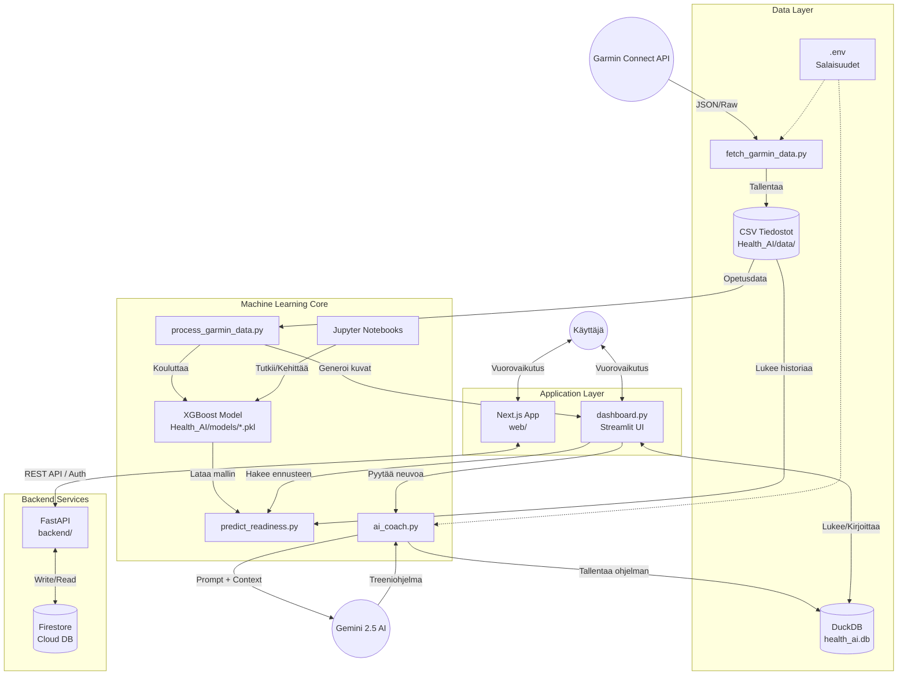

# Arkkitehtuuri - Sami's AI Coach

## Järjestelmän Yleiskuva
Sami's AI Coach on datalähtöinen valmennusjärjestelmä, joka yhdistää Garminin fysiologisen datan, koneoppimisen (XGBoost) ennustemallit ja generatiivisen tekoälyn (Gemini 2.5) tarjotakseen personoitua palautumisanalyysiä ja treenisuosituksia.

## Arkkitehtuurikaavio (Mermaid)

## Komponentit

### 1. Data Layer (Tietovarasto)
*   **CSV-tiedostot (`Health_AI/data/`):** Pääasiallinen raakadatan varasto. Sisältää päivittäiset yhteenvedot, unidataa ja aktiviteetit.
*   **DuckDB (`health_ai.db`):** Lokaali tietokanta historialliselle datalle ja treeniohjelmille.
*   **Firestore (Cloud):** Käyttäjäkohtainen pilvitietokanta. Säilyttää tavoitteet (`goals`) ja tulevaisuuden dataa. Turvattu Security Ruleilla.

### 2. Machine Learning Core (Älykkyys)
*   **Backend API (`backend/`):** FastAPI-palvelin, joka toimii porttina kaikelle uudelle toiminnallisuudelle.
    *   **Auth:** Firebase ID Token verifikaatio middlewarena.
    *   **Endpoints:** `/goals`, `/next-workout`, jne.
*   **Datan haku (`fetch_garmin_data.py`):** Inkrementaalinen lataus Garmin Connectista.
*   **Mallinnus (`process_garmin_data.py`):** XGBoost-mallin koulutus ja ylläpito.
*   **AI Coach (`ai_coach.py`):** Kommunikoi Google Gemini API:n kanssa.

### 3. Application Layer (Käyttöliittymä)
*   **Web Frontend (`web/`):** Moderni Next.js -sovellus (React).
    *   Toimii pääasiallisena käyttöliittymänä tavoitteiden hallintaan.
    *   Viestii Backend API:n kanssa (Port 8000).
*   **Dashboard (`dashboard.py`):** (Legacy/Admin) Streamlit-näkymä syvälliseen data-analyysiin.

## Teknologia-stack
*   **Kieli:** Python 3.12, TypeScript
*   **ML:** XGBoost, Scikit-learn
*   **AI:** Google Gemini 2.5 Flash
*   **Backend:** FastAPI, Firebase Admin SDK
*   **Frontend:** Next.js, TailwindCSS
*   **Data:** Pandas, DuckDB, Firestore
*   **Infra:** Docker, Docker Compose
